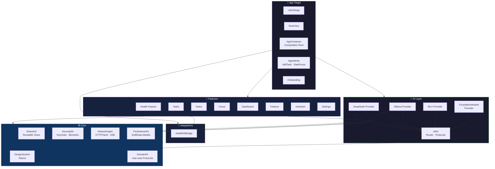

# LifeOS

> An AI-powered personal operating system for iPhone — built on iOS 26, Swift 6,
> SwiftUI, SwiftData, and Apple Intelligence.

[](https://github.com/Juanexgo/LifeOS/actions/workflows/ci.yml)


LifeOS combines an Apple-style Today screen, Tasks, Notes, Focus timer, Health,
Finance, and a streaming AI assistant — all behind a single calm, glassmorphic
interface that **runs Apple Intelligence on-device**. Cloud AI providers are
opt-in. Personal data never escapes the phone.

<!-- TODO: screenshots / GIF demo here -->

---

## Why this project

Most "AI productivity apps" in 2026 are thin wrappers around someone else's cloud
endpoint. LifeOS inverts that:

- **On-device AI is the default.** `FoundationModels` (iOS 26's Apple
  Intelligence) is the primary provider. Ollama and DeepSeek are explicit
  fallbacks the user has to enable.
- **Privacy is a compile-time choice.** Every AI request carries a privacy
  class. The router refuses to escalate `.personal` requests to cloud providers
  — it **fails closed** instead.
- **The architecture is enforced by the linker, not by convention.** Twenty-one
  framework targets, layered (Core → AI → Integrations → Features), with no
  cross-feature imports allowed.

This isn't a tutorial scaffold. It's a working, on-device-first iOS 26 app with
production-quality decisions on every layer.

---

## Architecture



**The dependency graph is enforced by Tuist:** features cannot import each
other. The App layer is the only place that knows every concrete type. AI
providers are reachable only via the `AIProvider` protocol — feature code never
imports a concrete provider.

[→ Full architecture deep-dive](docs/architecture.md)

---

## Tech stack

| Layer | Choice | Why |
|---|---|---|
| **Project** | [Tuist 4](https://tuist.io) | Declarative project generation. `Project.swift` is the single source of truth; `.xcodeproj` is gitignored and never causes merge conflicts. |
| **Language** | Swift 6.0, strict concurrency `complete` | No `@unchecked Sendable` shortcuts. The compiler proves the absence of data races. |
| **UI** | SwiftUI + iOS 26 Liquid Glass | Real `.glassEffect()`, not faked `.ultraThinMaterial`. |
| **State** | `@Observable` + `@MainActor` | No `ObservableObject` legacy patterns. |
| **Persistence** | SwiftData with `VersionedSchema` | Migrations planned for from day one. |
| **On-device AI** | `FoundationModels` (iOS 26) | Apple Intelligence's `SystemLanguageModel`. |
| **Cloud AI** | DeepSeek SSE / Ollama HTTP streaming | Custom `URLSession` + hand-rolled SSE parser. No Alamofire. |
| **Security** | `Keychain` + biometric `LAContext` | API keys are biometric-gated. Personal data file protection is `.completeUntilFirstUserAuthentication`. |
| **System integration** | AppIntents · EventKit · HealthKit · ActivityKit | Siri Shortcuts, calendar, health, Live Activities (target deferred — see roadmap). |

---

## Highlights for reviewers

If you're a hiring manager skimming this in two minutes, here are the decisions
I'd point you to:

1. **[`AIRouter`](Modules/AI/AIKit/Sources/AIRouter.swift)** — an `actor` with
   per-request privacy-class routing. `.personal` requests refuse to fall
   through to cloud providers even when on-device ones fail (`AIError
   .personalRequestEscalationBlocked`). Tested in [`LifeOSAppTests.swift`](App/Tests/LifeOSAppTests.swift).

2. **[`Tuist/ProjectDescriptionHelpers/Module.swift`](Tuist/ProjectDescriptionHelpers/Module.swift)** —
   a `Target.module(_:layer:dependencies:)` factory that enforces the modular
   layout. One call per module; the dependency graph lives in `Project.swift`
   and is linker-checked.

3. **[`DesignSystem`](Modules/Core/DesignSystem/Sources/)** — tokens for
   spacing, radius, motion curves, materials, palette, typography, and
   haptics. No raw values are allowed in feature code. Re-tuning the app's
   feel touches one file.

4. **[`Keychain`](Modules/Core/SecurityKit/Sources/Keychain.swift)** — biometric
   protection via `SecAccessControlCreateWithFlags` with `.biometryCurrentSet`
   (invalidated when the user adds/removes a face or fingerprint).

5. **[`SSEParser`](Modules/Core/NetworkingKit/Sources/SSEParser.swift)** —
   hand-rolled Server-Sent Events parser that the DeepSeek provider rides on.

---

## Build & run

### Prerequisites

- macOS 15+, Xcode 26.5+ (or later)
- [Tuist 4](https://tuist.io) — install with `brew install tuist`
- An iPhone running iOS 26.0+ (or simulator with iOS 26 runtime installed)

### Steps

```bash
# Clone
git clone <repo-url>
cd LifeOS

# Generate Xcode project
tuist generate

# Open in Xcode and Cmd+R to your iPhone or simulator
open LifeOS.xcworkspace
```

### CLI build (no Xcode required)

```bash
xcodebuild -workspace LifeOS.xcworkspace -scheme LifeOS \
  -configuration Debug \
  -destination 'generic/platform=iOS Simulator' \
  CODE_SIGNING_ALLOWED=NO build
```

---

## Feature tour

| Feature | What it does | Implementation notes |
|---|---|---|
| **Today** | Greeting + ambient gradient · progress ring · live task/calendar/focus summaries | `@Query` reactive · `AmbientBackground` with 18s gradient loop |
| **Tasks** | SwiftData CRUD · priority + due-date · swipe / context actions · symbol-effect completion | `Sort by` completion state (Int-backed), priority, createdAt |
| **Notes** | Markdown editor with edit/preview · pin · search across title+body | `AttributedString(markdown:)` for native rendering |
| **Focus** | Pomodoro timer with pause/resume · session history · auto-complete with success haptic | State machine in `FocusViewModel`, persisted via `FocusSession @Model` |
| **Health** | HealthKit read of steps + active calories · staged permission flow | `HKHealthStore` wrapped in an actor for safe concurrency |
| **Finance** | Expenses by category · monthly total numeral · breakdown chart | `Decimal`-precision via `Double`, locale-aware currency |
| **Assistant** | Streaming chat backed by `AIRouter` · empty-state · cancellation | `AsyncThrowingStream<AIChunk>` driving an `@Observable` view model |
| **Settings** | AI provider list · Ollama config · biometric DeepSeek key entry | Keychain with biometric `.biometryCurrentSet` gate |

---

## Roadmap

Deliberately not done in v0.3 — each requires a decision the project owner
should make, not me:

- [ ] **App Store icon** — currently a placeholder, designed via SwiftUI
      (`Tools/IconRenderer.swift`). Replace with a final design.
- [ ] **Widget Extension** — code is in `Widgets/LifeOSWidgets/` (today
      tasks widget + Focus Live Activity). Needs an App Groups entitlement
      to share the SwiftData store with the main app.
- [ ] **MLX provider** — real implementation requires `mlx-swift` SPM
      dependency + model download flow.
- [ ] **Accessibility audit** — VoiceOver labels on custom controls,
      Dynamic Type at the largest sizes, Reduce Motion respected.
- [ ] **Localization** — strings extraction to `Localizable.xcstrings`,
      Spanish translation.
- [ ] **App Store distribution** — needs paid Apple Developer Program.

[→ See `docs/adr/`](docs/adr/) for the architecture decisions made (or
deliberately deferred).

---

## License

Personal portfolio project. Code under MIT for now — see `LICENSE` if/when
this becomes a real product.

## Author

**Juan José Canul** · iOS Engineer
